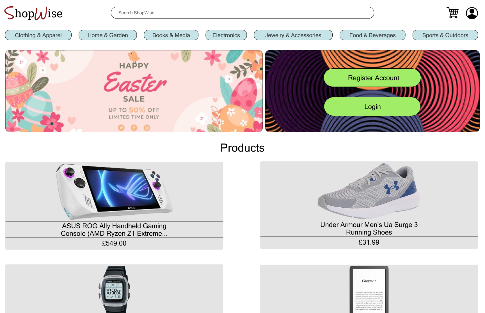
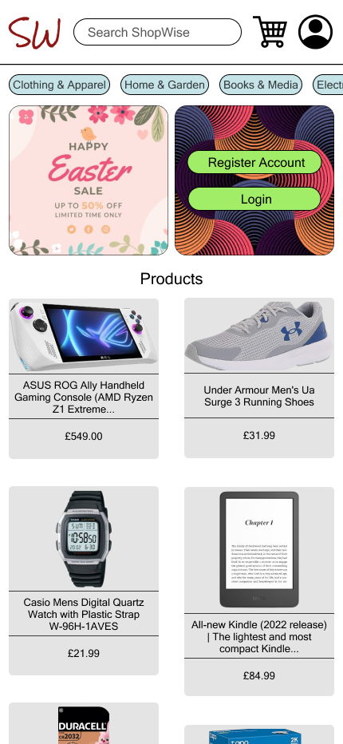

# ShopWise 

> The frontend for an E-Commerce Web App built using React.

## Table of contents
* [General Information](#general-information)

* [Technologies Used](#technologies-used)

* [Setup](#setup)

* [Project Status](#project-status)

* [Room for Improvement](#room-for-improvement)

* [Project Takeaways](#project-takeaways)


## Basic Wireframes:




## General Information:
- Build a functioning e-commerce web app using React
- Allow users to register and log in via the client side using either ShopWise account or Google.
- Allow creation of multiple carts
- Allow viewing of carts
- Allow viewing of a single cart
- Allow sorting of products by category
- Allow adding of products to carts
- Allow removal of products from carts
- Allow logout of users
- Allow adding of addresses, deletion of addresses and editing of addresses
- Allow setting of default addresses for later checkout
- Allow checkout of cart through Stripe payment
- Allow viewing of orders
- Allow viewing of a single order
- Use Git version control
- Use command line
- Develop locally on your computer


## Technologies Used:
- `@reduxjs/toolkit`: ^2.2.1,
- `axios`: ^1.6.7,
- `country-state-city`: ^3.2.1,
- `react-google-button`: ^0.7.2,
- `react-loader-spinner`: ^6.1.6",
- `react-redux`: ^9.1.0,
- `react-router-dom`: ^6.22.2,

## Setup
To set up locally, begin by installing node_modules:

```
npm install
```

This command will also execute the `install` script from `package.json`.
  

Then run the app which is located in `client/` directory:

```
npm start
```

## Project Status
In Progress: 
- Engaged in testing procedures.
- Handling of some errors related to url parameters.

## Room for Improvement
Room for improvement:
- Better use of useEffect hook.
- Better use of redux.
- Handling of errors.

To-Do:
- Handling of some errors related to url parameters.

## Project Takeaways
- Better ways of handling errors.
- Better ways of deploying properly with less issues.
- Learn typescript for react.
- Better implementation of CSS.